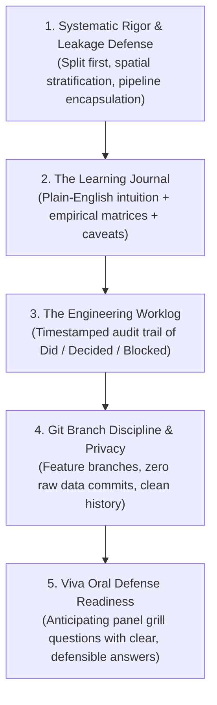

# Empirical Research & Learning Methodology Guide

**Project**: Data-Driven Resource Allocation of Insecticide-Treated Nets (ITNs) in Ghana — ICS553 Prosit 1  
**Author**: Eric Elikplim Sunu & Antigravity  
**Target Repository**: `https://github.com/ASU-MICS-2028/mle-group-3-prosit-1`

---

## 1. The Core Philosophy: "Explain to a Beginner, Build Like a Senior"

When tackling high-stakes statistical modeling, epidemiological resource allocation, and machine learning pipelines, we strictly enforce a **dual-layer standard**:

1. **The Senior Engineer Layer (Rigor & Mathematical Integrity):**
   - Zero data leakage (split first, fit second via scikit-learn `Pipeline` + `ColumnTransformer`).
   - Spatial block stratification to respect geographic autocorrelation.
   - Mathematically principled distribution selection (Negative Binomial over Poisson for over-dispersed counts).
   - Design-consistent survey uncertainty (two-stage cluster bootstrap).
   - Absolute privacy compliance: **Never print, echo, or commit licensed household rows from `data/`**.
2. **The Beginner / Student Layer (Pedagogy & Defense):**
   - Every statistical model, distribution, and confidence interval must first be explained in **plain, simple, beginner-friendly English** using **concrete everyday physical analogies** (e.g., the school pencil hoarder, the twin brother next door, the village survey map).
   - Once the intuition clicks, we link it directly to the **exact technical academic terminology** required for the oral Viva Defense panel. If you cannot explain *why* a number appeared on a slide to a 10-year-old, you cannot defend it before the examination committee.

---

## 2. The 5 Pillars of Our Workflow



---

### Pillar 1: Systematic Statistical Rigor (The Non-Negotiables)

1. **The Leakage Rule (Split First, Fit Second):**
   - No imputer, scaler, or encoder is ever fitted on data that includes the test set.
   - Analysis logic lives in `src/`. `src/io.py` owns the one split function. Never write a second one.
2. **Spatial Autocorrelation (No Naive Random Splits):**
   - Districts sitting next to each other share the same rainfall, river basin, and mosquito breeding ecology. A naive random split leaks information because the test district's "twin" is in the training set! Always split **stratified by geographic region**.
3. **Over-Dispersion & The Poisson Failure:**
   - In northern Ghana malaria counts, the variance is **77,204 times larger** than the mean ($\text{Var}/\text{Mean} \approx 77,204$). Poisson forces $\text{Var} = \text{Mean}$, assuming all districts are close to average and severely underestimating outbreak spikes. We fit Poisson only to mathematically prove its failure ($\chi^2/\text{df} \approx 54,100$), and use **Negative Binomial** ($\text{Var} = \mu + \alpha \mu^2$) as the true working model.
4. **Survey Design & Two-Stage Cluster Bootstrap:**
   - The Demographic and Health Survey (DHS) samples *clusters* (villages), not independent individuals. A naive bootstrap treats all households as independent, producing confidence intervals that are **1.8× too narrow** ($\text{DEFF} \approx 3.3$), creating dangerous false precision. We resample clusters with replacement, then households within chosen clusters.

---

### Pillar 2: The Learning Journal (`reports/LEARNING_JOURNAL.md`)

The Learning Journal is your **personal knowledge vault and oral exam revision guide**. It bridges raw code and deep conceptual mastery.

#### What Goes Into the Journal:
1. **The Mental Model / Plain-English Analogy:**
   - *Example (Over-dispersion):* "The Pencil Hoarder Analogy: In a class where the average student has 2 pencils, Poisson assumes everyone has 1, 2, or 3 pencils. In reality, 90 kids have 0 pencils, and 1 kid has a box of 200 pencils. Negative Binomial has a dispersion knob ($\alpha$) specifically made for hoarder outbreaks."
2. **The Empirical Results Table:**
   - Record exact numbers, statistical tests, degrees of freedom, and the exact notebook cell where the calculation occurred (e.g., Task A1, A2, A3, A4).
3. **Data Caveats & Real-World Anomalies:**
   - Document discrepancies between the data dictionary and the raw CSVs (e.g., anonymized cluster IDs, constant surveillance columns, administrative boundary splits post-2018). A documented data limitation is an academic finding you can defend!
4. **Viva Exam Q&A Bank:**
   - Anticipate the exact hostile questions an examiner will ask on slide numbers and draft bulletproof, plain-English responses.

---

### Pillar 3: The Engineering Worklog (`WORKLOG.md`)

The Worklog is the official audit trail required for course passing and individual AI declarations.

#### The Mandatory Worklog Format:
Every session must append an entry to the top of `WORKLOG.md`:

```markdown
## YYYY-MM-DD · HH:MM–HH:MM GMT · [Your Name]

**Branch:** [e.g., feature/theme-a]
**Assistant:** [e.g., Gemini / Antigravity], to [concise 1-sentence summary of the task].
**Did:**
- Concrete action 1 (e.g., implemented cluster bootstrap in `src/uncertainty.py`).
- Concrete action 2 (e.g., verified DHS weighted regional net ownership matches official report to 0.03pp).
**Decided:**
- Defensible modeling decision (e.g., adopted Negative Binomial due to variance/mean ratio of 77,204; rejected target encoding).
**Blocked / open questions:**
- Genuine uncertainties (e.g., boundary file mismatch for 7 post-2018 split districts).
**Next:**
- Concrete prioritized next steps for the upcoming session.
```

---

### Pillar 4: Git Branch Discipline & Data Privacy

1. **Strict Data Privacy (Zero Row Leakage):**
   - **Never print, display, echo, or commit rows from `data/`**. The DHS household health dataset is licensed.
   - Never use `.head()` on raw household records in public transcripts or terminal output.
   - All data paths must remain strictly excluded by `.gitignore`.
2. **Branch Workflow:**
   - Work strictly on feature branches (`feature/theme-a`, `feature/theme-b`).
   - Never push directly to `main`.
3. **Reproducibility & Paths:**
   - Never use absolute paths (e.g., `/Users/username/...`).
   - Always use relative paths via `pathlib.Path(__file__).parent`. The code must run seamlessly on a grader's clean machine.
4. **Notebook Cleanliness:**
   - Notebooks read like an academic narrative: import, call, plot, comment.
   - Logic longer than 20 lines belongs in a modular `.py` file inside `src/`.
   - Strip excessive raw outputs before git commit.

---

### Pillar 5: Viva Exam Readiness (Oral Defense)

When defending in front of the examination panel:

1. **"Why not allocate nets solely based on raw malaria case numbers?"**
   - *Plain Defense:* Raw cases measure clinic attendance, not true community infection. A wealthy district with 5 clinics will record thousands of cases; an impoverished district with zero clinics will record zero cases because nobody was tested! Furthermore, if a district already has 95% net ownership, sending more nets doesn't help. We must prioritize **unmet need** (high risk + low coverage + honest uncertainty).
2. **"Why did Poisson regression fail?"**
   - *Plain Defense:* Poisson enforces $\text{Mean} = \text{Variance}$. In our northern Ghana data, the variance is 77,000 times larger than the mean. Poisson assumes extreme outbreaks are mathematically impossible ($p < 10^{-100}$), which would leave high-risk outbreak districts unprotected. Negative Binomial allows the variance to expand through its dispersion parameter $\alpha$.
3. **"Why is a naive bootstrap unscientific on survey data?"**
   - *Plain Defense:* The DHS used two-stage cluster sampling (villages, then households). Households in the same village share the same swamp and risk. A naive bootstrap pretends 17,000 households are independent, shrinking confidence intervals by nearly half ($\text{DEFF} \approx 3.3$). A two-stage cluster bootstrap resamples villages first, capturing the true survey uncertainty.

---

## 3. Quick Checklist for Every Session

- [ ] Am I on my feature branch (`git status` shows `On branch feature/...`)?
- [ ] Did I ensure NO raw data rows or `data/` files are staged or printed?
- [ ] Is every model split-first and wrapped in a scikit-learn Pipeline?
- [ ] Did I log the exact results, tables, and plain-English takeaways in `reports/LEARNING_JOURNAL.md`?
- [ ] Did I record my time, assistant attribution, Did/Decided/Blocked/Next in `WORKLOG.md`?
- [ ] Did I commit my changes with a clean conventional commit message?
