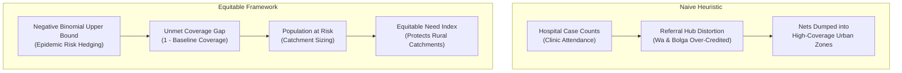

# Policy Framing & Decision Architecture — ITN Allocation in Ghana

**Project:** Data-Driven Resource Allocation of Insecticide-Treated Nets (ITNs) — ICS553 Prosit 1  
**Target Agency:** National Malaria Elimination Programme (NMEP), Ministry of Health, Ghana  
**Authors:** Group 3 (Eric Elikplim Sunu, Lead Analyst & Statistician)

---

## 1. Executive Summary & Problem Framing

Ghana’s National Malaria Elimination Programme (NMEP) has secured a targeted consignment of **50,000 long-lasting insecticide-treated nets (ITNs)**. The core policy challenge is to allocate this indivisible, resource-constrained shipment across northern Ghana's 50 districts in an equitable, defensible, and epidemiologically optimal manner.

Historically, health resource allocations have defaulted to **naive proportional heuristics**—distributing commodities strictly according to historical clinic case counts. This report establishes why that naive policy is scientifically flawed, introduces an uncertainty-aware decision framework, and establishes the formal trade-offs governing the allocation rule.

---

## 2. Decision Framing Components

### 2.1 Target Population
The target population comprises vulnerable individuals, primarily children under five and pregnant women, residing in the high-transmission savanna ecological zones of northern Ghana.

### 2.2 Unit of Analysis
- **Primary Operational Unit:** The administrative district ($n = 50$ districts spanning the Northern, Upper East, and Upper West regions as delineated in routine surveillance data).
- **Secondary Geographic Stratum:** The administrative region ($n = 3$ macro-regions), utilized for spatial stratification, macro-level baseline coverage estimation, and supply chain logistics hubs.

### 2.3 Evaluation Metric & Loss Function
The objective is to **minimize preventable malaria burden and epidemic mortality** under uncertainty:

1. **Epidemiological Risk (Negative Binomial Upper Bound):**
   Malaria transmission exhibits severe over-dispersion ($\text{Var}/\text{Mean} \approx 77,183$). Standard Poisson models severely underestimate high-burden outbreak tails. We model transmission risk using a Negative Binomial regression with $\log(\text{population})$ offset and evaluate each district at the **upper bound of its 95% prediction interval** ($\hat{\mu}_{i,\text{upper}}$).
2. **Unmet Coverage Gap:**
   Nets provide individual and community mass-action protection. Districts that already possess high coverage experience diminishing marginal epidemiological returns. The unmet gap is defined as:
   $$g_i = 1 - \frac{\text{net\_coverage\_pct}_i}{100}$$
3. **Asymmetric Loss Function:**
   The social cost of *under-allocating* nets to a high-transmission rural district is severe (excess pediatric mortality, school absenteeism, epidemic outbreaks). Conversely, the cost of *over-allocating* is modest (storage friction, marginal depreciation). Therefore, evaluating at the **upper bound of risk ($\hat{\mu}_{\text{upper}}$)** implements an asymmetric minimax loss function, insuring rural populations against catastrophic surges.

### 2.4 Operational & Physical Constraints
- **Resource Ceiling:** Total nets allocated must equal exactly $N = 50,000$:
  $$\sum_{i=1}^{50} A_i = 50,000$$
- **Integer Indivisibility:** A net is an indivisible physical asset ($A_i \in \mathbb{Z}_{\ge 0}$). Fractional allotments are mathematically invalid. We enforce integer allocation via **Hamilton's Largest Remainder Method**.
- **Non-Negativity & Monotonicity:** Every district receives $A_i \ge 0$, scaled strictly by its validated epidemiological need.

---

## 3. Equity vs. Efficiency Trade-offs

### The Referral Hospital Bias (The Central Distortion)
In northern Ghana, tertiary and regional referral hospitals (e.g., Bolgatanga Regional Hospital in Upper East, Wa Regional Hospital in Upper West) possess superior diagnostic capacity, reliable rapid diagnostic tests (RDTs), and physician staffing. Consequently, thousands of patients travel from surrounding rural districts (e.g., Nabdam, Bongo, Sissala East, Lambussie) to seek treatment.

- **The Naive Failure:** Routine health information systems (DHIMS-2) record these malaria cases at the *facility of diagnosis*, not the *patient's residence*. A naive allocation allocates $3,015$ nets to Bolgatanga and $2,610$ nets to Wa because their hospital registries show massive numbers.
- **The Equity Reality:** Both Bolgatanga and Wa already exhibit high baseline net ownership (~$79.6\%$ and ~$69.8\%$). Dumping thousands of additional nets into these referral centers saturates already-covered households while depriving the rural sending communities where mosquito breeding and transmission actually occur.

### Urban vs. Rural Access Disparities
Rural populations face severe geographical barriers to health clinics, leading to systematic under-testing and under-reporting. Allocating resources based solely on positive test counts creates an adverse feedback loop: **districts with fewer clinics record fewer cases, receive fewer nets, suffer higher unmeasured disease burden, and fall further behind**.

---

## 4. Formal Decision Rules

### Policy A: The Naive Baseline
Allocates nets strictly proportionally to raw reported positive cases:
$$A_i^{\text{naive}} = \text{round}\left(50,000 \times \frac{Y_i}{\sum_{j=1}^{50} Y_j}\right)$$

### Policy B: The Uncertainty-Aware Equitable Policy (Proposed)
Allocates nets proportionally to the composite unmet need index:
$$W_i = \hat{\mu}_{i,\text{upper}} \times \left(1 - \frac{\text{coverage}_i}{100}\right)$$
$$A_i^{\text{equitable}} = \text{HamiltonApportionment}\left(W_i, 50000\right)$$

---

## 5. Defense Summary for the Ministry Panel

| Evaluation Dimension | Naive Policy | Proposed Equitable Policy |
|---|---|---|
| **Underlying Statistical Model** | None (Deterministic counts) | Negative Binomial regression with log(population) offset |
| **Handling of Over-Dispersion** | Ignored | Explicitly modeled ($\alpha = 0.2677$) |
| **Uncertainty Quantification** | Point estimate only | Upper 95% prediction interval (epidemic hedge) |
| **Accounting for Baseline Coverage** | None (Assumes zero starting nets) | Penalizes saturated districts, prioritizes coverage gap |
| **Referral Hospital Bias** | Severe (Favors urban centers) | Corrected (Reallocates to rural catchments) |
| **Budget Enforcement** | Naive rounding errors | Exact integer Hamilton apportionment ($\sum A_i = 50,000$) |
