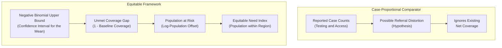

# Policy Framing & Decision Architecture — ITN Allocation in Ghana

**Project:** Data-Driven Resource Allocation of Insecticide-Treated Nets (ITNs) — ICS553 Prosit 1  
**Target Agency:** National Malaria Elimination Programme (NMEP), Ministry of Health, Ghana  
**Authors:** Group 3 (Eric Elikplim Sunu, Lead Analyst & Statistician)

---

## 1. Executive Summary & Problem Framing

Ghana’s National Malaria Elimination Programme (NMEP) has secured a targeted consignment of **50,000 long-lasting insecticide-treated nets (ITNs)**. The core policy challenge is to allocate this indivisible, resource-constrained shipment across northern Ghana's 50 districts in an equitable, defensible, and epidemiologically optimal manner.

Ghana distributes ITNs mainly by population, through mass campaigns at about one net per two people plus antenatal, child-welfare and school channels (PMI Ghana Malaria Operational Plan FY2017). For a targeted consignment, a tempting alternative is to follow reported cases. This report explains why a purely **case-proportional rule** is flawed, sets out our uncertainty-aware rule, and states the trade-offs it makes.

---

## 2. Decision Framing Components

### 2.1 Target Population
The target population comprises vulnerable individuals, primarily children under five and pregnant women, residing in the high-transmission savanna ecological zones of northern Ghana.

### 2.2 Unit of Analysis
- **Primary Operational Unit:** The administrative district ($n = 50$ districts spanning the Northern, Upper East, and Upper West regions as delineated in routine surveillance data).
- **Secondary Geographic Stratum:** The administrative region ($n = 3$ macro-regions), utilized for spatial stratification, macro-level baseline coverage estimation, and supply chain logistics hubs.

### 2.3 Evaluation Metric & Loss Function
The objective is to **minimize preventable malaria burden and epidemic mortality** under uncertainty:

1. **Epidemiological Risk (Negative Binomial Upper Bound):**
   Malaria transmission exhibits severe over-dispersion ($\text{Var}/\text{Mean} \approx 77,183$). Standard Poisson models severely underestimate high-burden outbreak tails. We model transmission risk using a Negative Binomial regression with $\log(\text{population})$ offset and evaluate each district at the **upper bound of the 95% confidence interval for its expected cases** ($\hat{\mu}_{i,\text{upper}}$). This is a confidence interval for the mean, not a prediction interval for a district's count.
2. **Unmet Coverage Gap:**
   Nets provide individual and community mass-action protection. Districts that already possess high coverage experience diminishing marginal epidemiological returns. The unmet gap is defined as:
   $$g_i = 1 - \frac{\text{net\_coverage\_pct}_i}{100}$$
3. **Asymmetric Loss Function:**
   The social cost of *under-allocating* nets to a high-transmission rural district is severe (excess pediatric mortality, school absenteeism, epidemic outbreaks). Conversely, the cost of *over-allocating* is modest (storage friction, marginal depreciation). Therefore, evaluating at the **upper bound of risk ($\hat{\mu}_{\text{upper}}$)** implements an asymmetric minimax loss function, insuring rural populations against catastrophic surges. In practice, because coverage is one number per region, the upper bound multiplies each region by a constant (1.198, 1.342 and 1.162), so it shifts nets between regions rather than protecting particular districts (`04_allocation.ipynb`, alloc_cd11).

### 2.4 Operational & Physical Constraints
- **Resource Ceiling:** Total nets allocated must equal exactly $N = 50,000$:
  $$\sum_{i=1}^{50} A_i = 50,000$$
- **Integer Indivisibility:** A net is an indivisible physical asset ($A_i \in \mathbb{Z}_{\ge 0}$). Fractional allotments are mathematically invalid. We enforce integer allocation via **Hamilton's Largest Remainder Method**.
- **Non-Negativity & Monotonicity:** Every district receives $A_i \ge 0$, in proportion to its weight $W_i$.

---

## 3. Equity vs. Efficiency Trade-offs

### Referral Hospital Bias: A Hypothesis to Test
Regional hospitals (Upper East Regional Hospital in Bolgatanga, Upper West Regional Hospital in Wa) are secondary referral facilities; Tamale Teaching Hospital is the only tertiary hospital for the three northern regions (claims table, E-03). Routine data (DHIMS-2) are aggregated by reporting facility, so patients who travel to a regional hospital may be counted in the hospital's district.

- **What it would predict:** hospital districts should report more cases per person than their neighbours. The case-proportional comparator gives Bolgatanga 3,015 nets and Wa 2,610.
- **What our data show:** Wa ranks 1st of 11 in Upper West on cases per person, consistent with the hypothesis. Bolgatanga ranks only 4th of 13 in Upper East, Nabdam (often named as a sending district) reports the most cases per person of all 50 districts, and Tamale, home to the tertiary hospital, reports the fewest (`04_allocation.ipynb`, alloc_cd11). The evidence is mixed, so we treat referral bias as a hypothesis, not a finding. Net coverage is known only by region (Upper East 79.6%, Upper West 69.8%), so it says nothing about these districts in particular.

### Urban vs. Rural Access Disparities
Rural populations face geographical barriers to health clinics, leading to under-testing and under-reporting. Allocating resources based solely on positive test counts creates an adverse feedback loop: **districts with fewer clinics record fewer cases, receive fewer nets, suffer higher unmeasured disease burden, and fall further behind**. Our data are consistent with this: Northern Region has the highest median test positivity (65%) but the fewest reported cases per person (0.27 a year, against 0.88 in Upper East and 0.80 in Upper West), a pattern that fits under-testing (`scripts/verify_claims.py`, section E).

---

## 4. Formal Decision Rules

### Policy A: The Case-Proportional Comparator
Allocates nets in proportion to reported positive cases $Y_i$, apportioned by the same Hamilton method:
$$A_i^{\text{naive}} = \text{HamiltonApportionment}\left(Y_i, 50000\right)$$

### Policy B: The Uncertainty-Aware Equitable Policy (Proposed)
Allocates nets proportionally to the composite unmet need index:
$$W_i = \hat{\mu}_{i,\text{upper}} \times \left(1 - \frac{\text{coverage}_i}{100}\right)$$
$$A_i^{\text{equitable}} = \text{HamiltonApportionment}\left(W_i, 50000\right)$$

---

## 5. Defense Summary for the Ministry Panel

| Evaluation Dimension | Case-Proportional Comparator | Proposed Equitable Policy |
|---|---|---|
| **Underlying Statistical Model** | None (reported counts) | Negative Binomial regression with log(population) offset |
| **Handling of Over-Dispersion** | Ignored | Explicitly modeled ($\alpha = 0.2677$) |
| **Uncertainty Quantification** | Point estimate only | Upper 95% confidence bound for expected cases (one multiplier per region) |
| **Accounting for Baseline Coverage** | None (assumes zero starting nets) | Weights by the regional coverage gap; because the coverage coefficient is positive, higher-coverage regions still receive more nets per person |
| **Within-Region Allocation** | Follows reported cases, so it rewards districts that test more | Follows population, so it treats everyone in a region as equally at risk |
| **Referral Hospital Bias** | Counted in full, if present | Not modelled directly; a hypothesis with mixed evidence (section 3) |
| **Budget Enforcement** | Exact integer Hamilton apportionment | Exact integer Hamilton apportionment ($\sum A_i = 50,000$) |
